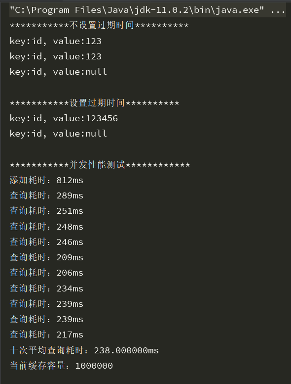

# 令牌桶算法 
位于com.yuanshijia.javalearn.requestlimit包下
```java
public class TokenBucket {

    /**
     * 桶的容量
     */
    private int capacity;


    /**
     * 令牌放入速度
     */
    private int rate;

    /**
     * 当前令牌数量
     */
    private int tokens;

    /**
     * 时间
     */
    private long timestamp = getNowTime();

    public TokenBucket() {
        this.capacity = 100;
        this.rate = 1;
    }


    public TokenBucket(int capacity, int rate) {
        this.capacity = capacity;
        this.rate = rate;
    }

    private long getNowTime(){
        return System.currentTimeMillis();
    }

    /**
     * 判断桶的容量和令牌数量哪个小
     * @param tokens
     * @param capacity
     * @return
     */
    private int min(int tokens, int capacity) {
        // 如果桶的容量比令牌数量多，
        return capacity > tokens ? tokens : capacity;
    }

    /**
     * 获取令牌
     * @return
     */
    public boolean getToken(){
        // 获取当前时间
        long nowTime = getNowTime();

        // 先添加令牌
        tokens = tokens + (int) ((nowTime - timestamp) * rate);

        // 添加令牌后的数量与桶的容量比较，哪个小
        tokens = min(tokens, capacity);

        System.out.println("当前令牌数量：" + tokens);

        // 修改拿令牌时间
        timestamp = nowTime;

        // 判断令牌是否足够
        if (tokens < 1) {
            // 若不到1个令牌，则拒绝
            return false;
        }

        // 发放令牌
        tokens -= 1;
        return true;
    }

}
```


# jdkcache 实现一个简单的缓存
https://blog.csdn.net/u013314786/article/details/80658738

位于com.yuanshijia.javalearn.jdkcache包下

代码示例：
```java
import java.util.Map;
import java.util.concurrent.*;

/**
 * @Author: lixk
 * @Date: 2018/5/9 15:03
 * @Description: 简单的内存缓存工具类，使用ConcurrentHashMap
 */
public class Cache2 {
    /**
     * 键值对集合
     */
    private final static Map<String, Entity> map = new ConcurrentHashMap<>();

    /**
     * 定时器线程池，用于清除过期缓存
     */
    private final static ScheduledExecutorService executor = Executors.newSingleThreadScheduledExecutor();

    /**
     * 添加缓存
     *
     * @param key  键
     * @param data 值
     */
    public static void put(String key, Object data) {
        put(key, data, 0);
    }

    /**
     * 添加缓存
     *
     * @param key    键
     * @param data   值
     * @param expire 过期时间，单位：毫秒， 0表示无限长
     */
    public  static void put(String key, Object data, long expire) {
        //清除原键值对
        remove(key);
        //设置过期时间
        if (expire > 0) {
            Future future = executor.schedule(() -> {
                //过期后清除该键值对
                map.remove(key);
            }, expire, TimeUnit.MILLISECONDS);
            map.put(key, new Entity(data, future));
        } else {
            //不设置过期时间
            map.put(key, new Entity(data, null));
        }
    }

    /**
     * 读取缓存
     *
     * @param key 键
     * @return
     */
    public static Object get(String key) {
        Entity entity = map.get(key);
        return entity == null ? null : entity.getValue();
    }

    /**
     * 读取缓存
     *
     * @param key 键
     * @param clazz 值类型
     * @return
     */
    public  static <T> T get(String key, Class<T> clazz) {
        return clazz.cast(Cache2.get(key));
    }

    /**
     * 清除缓存
     *
     * @param key
     * @return
     */
    public static Object remove(String key) {
        //清除原缓存数据
        Entity entity = map.remove(key);
        if (entity == null) {
            return null;
        }
        //清除原键值对定时器
        Future future = entity.getFuture();
        if (future != null) {
            future.cancel(true);
        }
        return entity.getValue();
    }

    /**
     * 查询当前缓存的键值对数量
     *
     * @return
     */
    public  static int size() {
        return map.size();
    }

    /**
     * 缓存实体类
     */
    private static class Entity {
        /**
         * 键值对的value
         */

        private Object value;
        /**
         * 定时器Future
         */
        private Future future;

        public Entity(Object value, Future future) {
            this.value = value;
            this.future = future;
        }

        public Object getValue() {
            return value;
        }

        public Future getFuture() {
            return future;
        }
    }
}
```

### Cache运行结果(synchronized锁)：


### Cache2运行结果(ConcurrentHashMap)：


从结果可以看出，ConcurrentHashMap实现的查询速度明显优于加synchronized的


